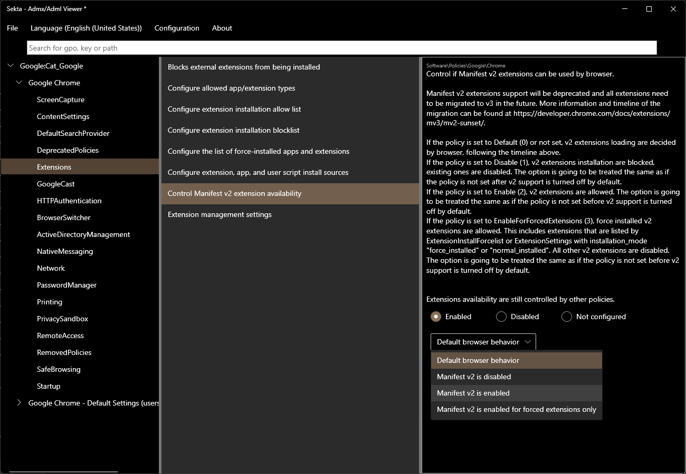

  

  

  

 

---

### Sekta - Admx/Adml Viewer 🥳

`Sekta` is a simple application that let's you open Windows/Office Group Policy Settings files (*.admx). Policies can be configured and exported as Powershell scripts or Intune OMA policies.

# Features
- View `admx` files
- Select any number of translations (`adml` files) and switch between them easily
- Configure policies (enable, disable, "not configured", including value & list support)
- Save and load configured policies
- Export policies as `powershell` script (ready to be executed) or view as OMA policies (for intune)
- Light & Dark mode 😎

---

 

# 🧐 Project idea

I haven't been able to find any public application that can view admx files. 
There are sites that let you view most known policies but it's impossible to play around with the policies. 
For example select a few policies and configure them. That's why I decided to write this desktop application.
Support for `adml` was neccessary because some OEMs do not name there policies meaningfully (but use uuids).

# ⚠️ License

Sekta is free and open-source software licensed under MIT.  

#  🔒 Data Privacy

## Information collected 
Sekta does not collect any personal identiying information. 
 
## Use of information 
No information is collected or shared over the wire. We reserve the right to 
make changes to this policy. Any changes to this policy will be updated. 

 
